# Прототип RAG-системы

## 1. Описание проекта и цель

Проект реализует end-to-end RAG (Retrieval-Augmented Generation) сервис вопрос-ответ по русскоязычной базе знаний RuBQ 2.0.

Система состоит из трех компонентов:
- `Indexing Service`: загрузка данных, quality checks, препроцессинг, векторизация, запись в Qdrant.
- `Query Service`: HTTP API `POST /query`, retrieval релевантных чанков, формирование промпта, запрос к LLM.
- `Vector DB (Qdrant)`: хранение эмбеддингов и метаданных чанков.

## 2. Архитектурная схема

Блок-схема компонентов и их взаимодействия:

```mermaid
flowchart LR
    ruBQ["RuBQ_2.0_paragraphs.json"] --> indexingService["IndexingService"]
    indexingService --> qualityChecks["QualityChecks"]
    qualityChecks --> preprocessing["PreprocessingAndChunking"]
    preprocessing --> embeddingModel["LaBSEEmbeddings"]
    embeddingModel --> qdrantDB["QdrantCollection(rubq_paragraphs)"]

    userClient["UserClient"] --> queryAPI["FastAPIQueryService(/query)"]
    queryAPI --> questionEmbedding["LaBSEQueryEmbedding"]
    questionEmbedding --> qdrantDB
    qdrantDB --> retrievedChunks["TopKChunks(uid,pageid,text,score)"]
    retrievedChunks --> promptBuilder["PromptBuilder"]
    promptBuilder --> hfInference["HuggingFaceInferenceAPI"]
    hfInference --> queryAPI
    queryAPI --> userClient
```



### 2.1. Структура репозитория

```text
.
├── docker-compose.yml
├── dockerfiles/
│   ├── Dockerfile.indexing
│   └── Dockerfile.query
├── requirements.txt
├── scripts/
│   └── e2e_docker_test.py
├── src/
│   ├── config/
│   │   └── config.py
│   ├── data/
│   │   ├── loader.py
│   │   └── preprocessing.py
│   ├── embeddings/
│   │   ├── model.py
│   │   └── vector_store.py
│   ├── indexing_service/
│   │   ├── cli.py
│   │   └── pipeline.py
│   └── query_service/
│       ├── api.py
│       ├── llm_client.py
│       ├── prompt_builder.py
│       ├── rag_chain.py
│       └── schemas.py
└── tests/
    ├── test_api_e2e.py
    ├── test_preprocessing.py
    ├── test_prompt_builder.py
    └── test_rag_chain.py
```

## 3. Установка зависимостей

В корне репозитория обязателен файл `requirements.txt`. Установка зависимостей:

```bash
python3 -m venv .venv
source .venv/bin/activate
pip install -r requirements.txt
```

## 4. Запуск

### 4.1. Локально

1) Установить зависимости (раздел 3) и запустить Qdrant (локально или в Docker).

2) Запустить индексацию:

```bash
python -m src.indexing_service.cli \
  --source https://raw.githubusercontent.com/vladislavneon/RuBQ/refs/heads/master/RuBQ_2.0/RuBQ_2.0_paragraphs.json
```

3) Запустить API:

```bash
uvicorn src.query_service.api:app --host 0.0.0.0 --port 8000
```

### 4.2. Через Docker Compose

Поднять сервисы и собрать образы:

```bash
docker-compose up --build
```

Для фонового режима (qdrant + query):

```bash
docker-compose up --build -d qdrant query
```

Сервис `query` может стать готов к приёму запросов **через 1–2 минуты** из-за загрузки модели LaBSE. Рекомендуется дождаться готовности по эндпоинту `GET /ready` (или `GET /health`), затем вызывать `POST /query`. Для curl задайте увеличенный таймаут, например `--max-time 120`.

Запустить индексацию отдельно (one-shot):

```bash
docker-compose run --rm indexing \
  python -m src.indexing_service.cli \
  --source https://raw.githubusercontent.com/vladislavneon/RuBQ/refs/heads/master/RuBQ_2.0/RuBQ_2.0_paragraphs.json \
  --parquet-output ''
```

Важно: не запускайте одновременно два контейнера `indexing`, так как оба пишут в общий Hugging Face cache (`./hf_cache`), что может приводить к ошибкам с `*.incomplete`.

#### Конфигурация

Параметры задаются в `src/config/config.py` и через переменные окружения (или `.env`):
- `QDRANT_URL` (по умолчанию `http://localhost:6333`)
- `HF_API_TOKEN`
- `HF_LLM_MODEL`
- `HF_LLM_MAX_NEW_TOKENS` (по умолчанию `1024`)
- `MAX_CONTEXT_CHARS` (по умолчанию `8000`)
- `RETRIEVAL_SCORE_THRESHOLD` (по умолчанию `0.5`)

Пример `.env`:

```env
HF_API_TOKEN=your_token_here
HF_LLM_MODEL=model
```

#### Troubleshooting индексации (Hugging Face cache)

Если видите ошибку вида `FileNotFoundError ... .incomplete`:

1. Остановите контейнеры индексации (если они запущены):
```bash
docker-compose stop indexing
```
2. Очистите частично скачанные артефакты модели:
```bash
rm -rf ./hf_cache/hub/models--sentence-transformers--LaBSE
```
3. Повторите индексацию только одним процессом:
```bash
docker-compose run --rm indexing \
  python -m src.indexing_service.cli \
  --source https://raw.githubusercontent.com/vladislavneon/RuBQ/refs/heads/master/RuBQ_2.0/RuBQ_2.0_paragraphs.json \
  --parquet-output ''
```

## 5. Использованные технологии, модели и обоснование выбора

- **FastAPI** + **uvicorn**: простой и быстрый API сервис для inference.
- **Эмбеддинги:** `sentence-transformers/LaBSE` — мультиязычная модель, хорошо подходит для русского языка; выбор обусловлен поддержкой ru и качеством sentence embeddings.
- **Векторная БД:** **Qdrant** — легковесная, контейнеризуемая, с удобным HTTP/gRPC API; подходит для прототипа и горизонтального масштабирования.
- **LLM:** **Hugging Face Inference API**: Использование Inference API упрощает прототипирование без локального хостинга тяжелой генеративной модели; для продакшена возможен переход на отдельный сервис или локальный inference.
- **pytest**: unit- и интеграционные тесты.

## 6. API Сервиса Запросов (формат запроса и ответа)

Endpoint: `POST /query`

Проверить готовность сервиса: `GET /ready` (200 — модель загружена, можно вызывать `/query`) или `GET /health` (лёгкая проверка, что процесс запущен).

Пример запроса (рекомендуется таймаут 120 с для первого запроса после старта):

```bash
curl --max-time 120 -X POST "http://localhost:8000/query" \
  -H "Content-Type: application/json" \
  -d '{"question":"Кто такой Юрий Гагарин?","top_k":5}'
```

**Формат запроса:**

```json
{
  "question": "Кто такой Юрий Гагарин?",
  "top_k": 5
}
```

**Формат ответа:**

```json
{
  "question": "Кто такой Юрий Гагарин?",
  "answer": "Юрий Гагарин — ...",
  "chunks": [
    {
      "uid": 123,
      "ru_wiki_pageid": 456,
      "score": 0.87,
      "text": "..."
    }
  ]
}
```

Пайплайн запроса:
1. Валидация и препроцессинг вопроса (`strip`, проверка непустой строки).
2. Поиск top-k чанков в Qdrant по эмбеддингу вопроса.
3. Формирование промпта из вопроса и найденных чанков.
4. Генерация ответа через Hugging Face Inference API.
5. Возврат ответа и чанков с метаданными.

## 7. Результаты анализа данных и подход к проверке качества

**Источник данных:**  
`https://raw.githubusercontent.com/vladislavneon/RuBQ/refs/heads/master/RuBQ_2.0/RuBQ_2.0_paragraphs.json`

**Базовый анализ (RuBQ 2.0 paragraphs):**
- Колонки: `uid`, `ru_wiki_pageid`, `text`
- Размер: `56_952` строк
- `uid.nunique() == 56_952`
- `ru_wiki_pageid.nunique() == 9_105`
- Длина `text`: медиана около `343`, есть короткие и очень длинные параграфы

**Проверки качества перед векторизацией:**  
Реализованы базовые проверки; результаты проверок **логируются** в `run_quality_checks`. Документы, не прошедшие проверки, **отфильтровываются** (удаляются из пайплайна перед созданием эмбеддингов):

- пустые документы (`text` is null / empty after trim) удаляются;
- дубликаты по `uid` удаляются;
- слишком короткие тексты (`len(text) < 20`) удаляются;
- дубликаты по `text` удаляются.

**Препроцессинг** (`src/data/preprocessing.py`): нормализация пробелов (`strip`); чанкинг длинных текстов (`MAX_LEN=1000`, `CHUNK_SIZE=600`, `OVERLAP=100`); защита от edge-case без пробелов; каждый чанк наследует метаданные источника.

## 8. Тесты (описание и запуск)

Запуск тестов:

```bash
pytest -q
```

Реализовано:
- unit-тесты препроцессинга и quality checks (`tests/test_preprocessing.py`);
- unit-тесты prompt builder (`tests/test_prompt_builder.py`);
- unit-тесты RAG-цепочки с моками Qdrant/LLM (`tests/test_rag_chain.py`);
- интеграционный API-тест с мокнутым RAG (`tests/test_api_e2e.py`);
- E2E скрипт для проверки пайплайна Q&A после запуска docker-compose (`scripts/e2e_docker_test.py`).

## 9. Улучшения и масштабирование системы

Возможные шаги для масштабирования:
- горизонтальное масштабирование **Query Service** (несколько реплик за балансировщиком нагрузки);
- переход на внешнюю/кластерную конфигурацию **Qdrant** (более производительная векторная БД в кластере);
- вынос LLM в отдельный сервис или локальный inference backend;
- добавление reranker (cross-encoder) после retrieval;
- фильтрация retrieval по расширенным метаданным и кэширование популярных запросов.
